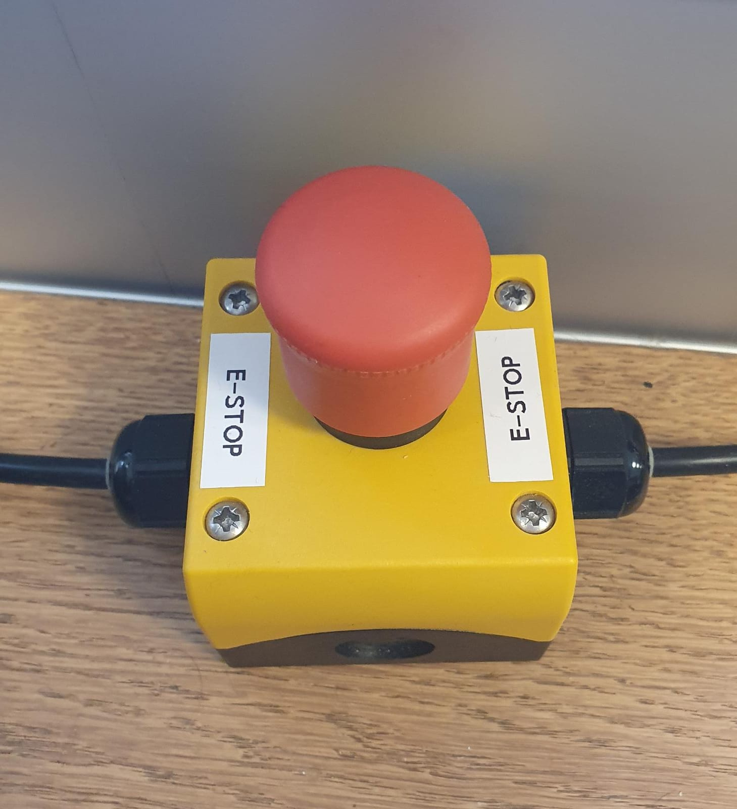

# panda-robot-control
This repository is made in order to simplify the setup of the Emika Frank Robot Arm at the DTU. It will give instruction concerning the start up proedure, the launching of the controller and set up of the camera driver.
# Table of Contents
1. [Robot User Handbook](#handbook)
2. [Start up procedure](#startUp)
3. [Set up of the repository](#repository)
4. [Create a catkin workspace](#catkinWorkspace)
5. [Launching the MRAC controller](#mracLaunch)
6. [Setup of the camera driver](#cameraDriver)
7. [Debugging](#debugging)


## Robot User Handbook
## Start up procedure for the Panda Robot Arm
1. Ensure everything is connected properly
2. Turn on the black controller box below the table of the robot arm
3. Turn on the university computer and log in
4. Disengage the red-yellow Emergency Stop Button labeled as E-Stop button. The robot arm should now be blinking yellow indicating that it is during the start up procedure. If the robot is not blinking yellow it mostproperly does not have any power.

5. Wait until the light begins to constantly blink yellow
6. Open the browser and navigate to https://172.16.0.3/desk/
7. On the website, navigate to 'Joints' on the right hand side and press the unlock button. Then, in the pop up window press 'open'. You will start hearing a clicking sound from the robot indicating that it is opening its joints. The light should now be white or blue.
8. If the light is blue make sure to press down the black "Mode" button. This will change the Mode from Ready Mode to Free-Moves Mode. You can now press the two buttons on the side of the end effector (the two that are right across from each other) to move the robot arm freely. Make sure to press them only lightly as a strong pressing will stop the robot from moving (safety feature). Furthermore, do not move the arm too fast either.
9. Make sure to orintate the robot in its default position (see picture) as extreme joint states makes it impossible to execute programs and send commands to the robot arm.
10. Disengage the Mode Button by rotating clockwise. The light should now be blue.
11. On the website, navigate to the menu and press "Activate FCI".
12. You are now able to send commands and receive information of the robot over ROS.
## Set up of the repository
This section gives you an introduction on how to clone the git repository into the catkin workspace of your choice.

First make sure that you have git installed and have a secure connection to your Github account. [Here](https://www.theserverside.com/blog/Coffee-Talk-Java-News-Stories-and-Opinions/GitHub-SSH-Key-Setup-Config-Ubuntu-Linux) you can find how to setup a ssh connection to your Github account on Ubuntu.

Now move to the location where you want to clone the git repository/catkin workspace then run:
```
git clone git@github.com:Nils1698/panda-robot-control.git
```

### Required ROS packages for the robot
There are 2 ROS packages needed, namely `libfranka` and `franka-ros` in order to run the controllers designed by other students. Have a look at [this](https://frankaemika.github.io/docs/installation_linux.html) website for installations instructions or write the following command in the terminal:
```
sudo apt install ros-noetic-libfranka ros-noetic-franka-ros
```
## Build a new catkin workspace
If the old worspace does not work is lost or the user wants to build a new workspace please follow this guide. Just be aware that problems and errors might occur as packages might be missing.
There is also a basic guide provided by wiki.ros.org which can be found [here](https://wiki.ros.org/catkin/Tutorials/create_a_workspace).

This tutorial assumes that you have installed catkin and sourced your environment. If you installed catkin via apt-get for ROS noetic, your command would look like this:
```
$ source /opt/ros/noetic/setup.bash
```
Let's create and build a catkin workspace: (you can give the folder a different name than "catkin_ws")
```
$ mkdir -p ~/catkin_ws/src
$ cd ~/catkin_ws/
$ catkin_make
```
Then make sure to source the file "catkin_ws/devel/setup.bash" inside of the bashrc file. In order to do so, write the following to open the .bashrc file and add the line "" in the end of it.
```
$ gedit ~/.bashrc
```
Make sure to save the file before closing it. The write: 
```
source ~/.bashrc
```
or reopen the terminal.

You can now start importing ros_packages inside the "src" folder. Generally, it is recommended to insert them one by one and run catkin_make from the workspace in between. If errors occur make sure that you understand them correctly. You might need to install missing packages. Sometimes packages are actually not needed so you might want to comment out lines and try to build again. If you do that however, keep track of which lines you comment out as they might be important later on.
## Launching the MRAC controller
## Setup of the BlueFox3 camera driver
In order to see camera pictures as a rostopic a driver needs to be installed first. You can follow the instructions of this readme or follow the instructions given on [this](https://www.matrix-vision.com/manuals/mvBlueFOX3/UseCases_section_working_with_ROS.html) website. 

Firstly, go to the website of [MatrixVision](https://www.matrix-vision.com/en/downloads/drivers-software/mvbluefox3-usb-3-0/linux-2-6-4-x-x) and download both files. Then, inside of your terminal move to the Downloads folder and give the installation program execution permissions:
```
chmod +x install_mvGenTL_Acquire.sh
```
Then execute it:
```
./install_mvGenTL_Acquire.sh
```
Afterwards, the terminal will lead you through the installation process. This takes a few minutes.
Once the installation is complete, the mvAcquire driver package needs to be installed. Follow the below instructions or have a look at [this](https://www.matrix-vision.com/manuals/SDK_CPP/InstallationFromPrivateSetupRoutines.html#InstallationFromPrivateSetupRouinesLinux) link for more information. 

Navigate into the folder "opt" in the root directory. In there create a folder:
```
sudo mkdir genicam
```
Make sure that the folder path is as follows "/opt/genicam". Now, the second file needs to be extracted into the newly build genicam folder:
```
sudo tar xzvf ~/Downloads/mv_mvGenTL_Acquire-x86_64_ABI2-2.47.0.tgz -C /opt/genicam
```
The above command assumes that the downloaded file has not been moved and is still inside of the downloads folder. The name of the file might be slightly different depending on the newest released driver. Change the name accordingly in that case.

Now, open the bashrc file with `gedit ~/.bashrc` and add the following lines in the end of the file:
```
export GENICAM_ROOT_V3_3=/opt/genicam
#if the next line shall work, $HOME/tmp must exist, which it does not by default, thus you might want to create it OR use the global 'tmp' folder
#export GENICAM_CACHE_V3_3=$HOME/tmp
export GENICAM_CACHE_V3_3=/tmp
export GENICAM_LOG_CONFIG_V3_3=$GENICAM_ROOT_V3_3/log/config-unix/DebugLogging.properties
```
Finally, you can install the required ROS packages:
```
sudo apt-get install ros-noetic-rc-genicam-api
sudo apt-get install ros-noetic-rc-genicam-camera
```
[Here](http://wiki.ros.org/rc_genicam_api) is also a help site for the rc-genicam-package package.

It is possible now to check if the camera is visible to the computer. Make sure that the USB cable is attached to the computer and then run:
```
gc_info -l
```
You should be able to see something like this:


If you do not see the camera try to use a different USB slot, source the .bashrc file, or visit the links listed above. Otherwise, good job, we are nearly done!

We can now run a script to stream some rostopics. In a terminal run `roscore`. While the roscore terminal stays open, run in a new terminal:
```
rosrun rc_genicam_camera rc_genicam_camera _device:={DeviceID}
```
Make sure to replace {DeviceID} with the actual device ID from the step above. 
You could now see that topics like "image_raw" are being published. Check with `rostopic list` in a new terminal. If you would like to visualize the data you can run:
```
rosrun rqt_image_view rqt_image_view
```
Make sure to select the correct topic in the top right of the screen. The image might be quiet dark. Reason is, that in the moment no calibration file is used when running the camera node.
## Debugging
## ROS packages of the repository
### franka-aic
This package has been made by Christian Kampp Kruse in 2022 and modified by Nils Meile. It mainly includes an MRAC controller and AIC controller which can be launched using the launch files. For more detailed information concerning the project Christians's Master thesis can be found [here](https://findit.dtu.dk/en/catalog/62fed4c8f4263013257cec89).