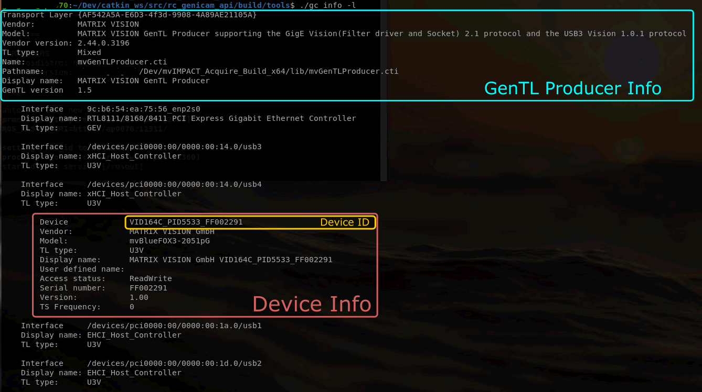

# panda-robot-control
This repository is made in order to simplify the setup of the Emika Frank Robot Arm at the DTU. It will give instruction concerning the start up proedure, the launching of the controller and set up of the camera driver.
# Table of Contents
1. [Robot User Handbook](#handbook)
2. [Start up procedure](#startUp)
3. [Set up of the repository](#repository)
4. [Create a catkin workspace](#catkinWorkspace)
5. [Launching the MRAC controller](#mracLaunch)
6. [Setup of the camera driver](#cameraDriver)
7. [Debugging](#debugging)


## Robot User Handbook
## Start up procedure
## Set up of the repository
### Required ROS packages for the robot
There are 2 ROS packages needed, namely `libfranka` and `franka-ros` in order to run the controllers designed by other students. Have a look at [this](https://frankaemika.github.io/docs/installation_linux.html) website for installations instructions or write the following command in the terminal:
```
sudo apt install ros-noetic-libfranka ros-noetic-franka-ros
```
## Build a new catkin workspace
If the old worspace does not work is lost or the user wants to build a new workspace please follow this guide.
There is also a guide provided by wiki.ros.org which can be found [here](https://wiki.ros.org/catkin/Tutorials/create_a_workspace).

This tutorial assumes that you have installed catkin and sourced your environment. If you installed catkin via apt-get for ROS noetic, your command would look like this:
```
$ source /opt/ros/noetic/setup.bash
```
Let's create and build a catkin workspace: (you can give the folder a different name than "catkin_ws")
```
$ mkdir -p ~/catkin_ws/src
$ cd ~/catkin_ws/
$ catkin_make
```
Then make sure to source the file "catkin_ws/devel/setup.bash" inside of the bashrc file. In order to do so, write the following to open the .bashrc file and add the line "" in the end of it.
```
$ gedit ~/.bashrc
```
Make sure to save the file before closing it. The write: 
```
source ~/.bashrc
```
or reopen the terminal.
## Launching the MRAC controller
## Setup of the BlueFox3 camera driver
In order to see camera pictures as a rostopic a driver needs to be installed first. You can follow the instructions of this readme or follow the instructions given on [this](https://www.matrix-vision.com/manuals/mvBlueFOX3/UseCases_section_working_with_ROS.html) website. 

Firstly, go to the website of [MatrixVision](https://www.matrix-vision.com/en/downloads/drivers-software/mvbluefox3-usb-3-0/linux-2-6-4-x-x) and download both files. Then, inside of your terminal move to the download folder and give the installation program execution permissions:
```
chmod +x install_mvGenTL_Acquire.sh
```
Then execute it:
```
./install_mvGenTL_Acquire.sh
```
Afterwards, the terminal will lead you through the installation process. This takes a few minutes.
Once the installation is complete, the mvAcquire driver package needs to be installed. Follow the below instructions or have a look at [this](https://www.matrix-vision.com/manuals/SDK_CPP/InstallationFromPrivateSetupRoutines.html#InstallationFromPrivateSetupRouinesLinux) link for more information. 

Navigate into the folder "opt" in the root directory. In there create a folder:
```
sudo mkdir genicam
```
Make sure that the folder path is as follows "/opt/genicam". Now, the second file needs to be extracted into the newly build genicam folder:
```
sudo tar xzvf ~/Downloads/mv_mvGenTL_Acquire-x86_64_ABI2-2.47.0.tgz -C /opt/genicam
```
The above command assumes that the downloaded file has not been moved and is still inside of the downloads folder. The name of the file might be slightly different depending on the newest released driver. Change the name accordingly in that case.

Now, open the bashrc file with `gedit ~/.bashrc` and add the following lines in the end of the file:
```
export GENICAM_ROOT_V3_3=/opt/genicam
#if the next line shall work, $HOME/tmp must exist, which it does not by default, thus you might want to create it OR use the global 'tmp' folder
#export GENICAM_CACHE_V3_3=$HOME/tmp
export GENICAM_CACHE_V3_3=/tmp
export GENICAM_LOG_CONFIG_V3_3=$GENICAM_ROOT_V3_3/log/config-unix/DebugLogging.properties
```
Finally, you can install the required ROS packages:
```
sudo apt-get install ros-noetic-rc-genicam-api
sudo apt-get install ros-noetic-rc-genicam-camera
```
[Here](http://wiki.ros.org/rc_genicam_api) is also a help site for the rc-genicam-package package.

It is possible now to check if the camera is visible to the computer. Make sure that the USB cable is attached to the computer and then run:
```
gc_info -l
```
You should be able to see something like this:

## Debugging
## ROS packages of the repository
### franka-aic
This package has been made by Christian Kampp Kruse in 2022 and modified by Nils Meile. It mainly includes an MRAC controller and AIC controller which can be launched using the launch files. For more detailed information concerning the project Christians's Master thesis can be found here XXXTODOXXX.